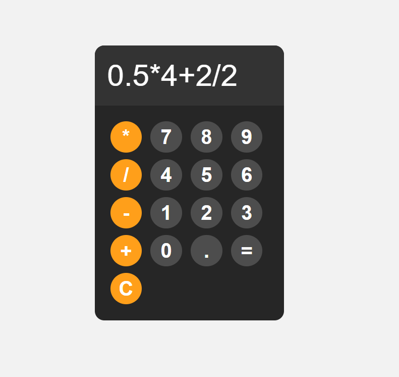

# Calculator

This is a simple calculator application.

## Features

- Basic arithmetic operations (addition, subtraction, multiplication, division)
- User-friendly interface

## Screenshot

## Installation

1. Clone the repository: `git clone https://github.com/Chol-Deng/calculator_4.git`
2. Navigate into the project directory: `cd calculator`

## Usage

1. **Start the application**: Run the application by opening the application file.

2. **Perform basic arithmetic operations**: Enter the first number, choose the operation (addition, subtraction, multiplication, division), enter the second number, and then press the equals button to see the result.

3. **Clear the input**: Press the clear(C) button to reset the calculator.

## Contributing

Pull requests are welcome. For major changes, please open an issue first to discuss what you would like to change.

## License

[MIT](https://choosealicense.com/licenses/mit/)
